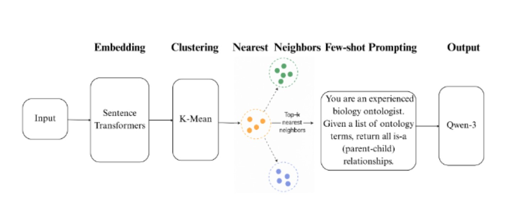

# 🧬 LLMs4OL 2025 – Task C1 (OBI)
## Hybrid Embedding–Clustering–LLM Pipeline for Taxonomy Discovery

This repository contains our solution for **Task C1 – Ontology for Biomedical Investigations (OBI)** in the **LLMs4OL 2025: Large Language Models for Ontology Learning Challenge**.

The goal is to automatically discover **taxonomic (is-a) relationships** between biomedical investigation types.

Given only a list of ontology types, the system predicts **parent → child** hierarchical relations and outputs them in the required `_pairs.json` format.

---

# 🧠 Methodology Overview

Our approach is a **three-stage hybrid pipeline**:

1. **Sentence Embeddings** → semantic representation  
2. **Clustering** → local ontology grouping  
3. **Large Language Model (LLM)** → hierarchical reasoning  

This design reduces noise, improves scalability, and enables directional is-a prediction.

---

# 🖼️ Methodology Diagram

> Replace `methodology.png` with your actual diagram filename

---

# ⚙️ Pipeline

## Stage 1 — Sentence Embeddings
- Model: `sentence-transformers/all-MiniLM-L6-v2`
- Converts each ontology type into a dense vector
- Captures semantic similarity between biomedical terms

## Stage 2 — Clustering
- Algorithm: **MiniBatch K-Means**
- Cluster size ≈ 50 terms per cluster
- Purpose:
  - Reduce search space
  - Group semantically related types
  - Enable local hierarchy discovery

## Stage 3 — LLM-based is-a Prediction
- Model: `unsloth/Qwen3-1.7B-unsloth-bnb-4bit`
- Quantized (4-bit) for memory efficiency
- Candidate parent–child pairs generated using **Top-K nearest neighbors**
- LLM performs **Yes/No classification** for is-a relations
- Batch inference used for faster processing

---

# 🧪 Implemented Approaches

## 1️⃣ Cosine Similarity Baseline
**File:** `cosine-similarity.ipynb`

Pipeline:
- Sentence-BERT embeddings  
- Pairwise cosine similarity  
- Threshold = **0.95** → predict is-a  

Limitation: captures similarity but **cannot model hierarchy direction**

---

## 2️⃣ K-Means Clustering + Few-Shot LLM
**File:** `kmeansclustuering-llm.ipynb`

Pipeline:
- Embeddings → clustering  
- Top-K candidate pairs  
- Few-shot prompting with biomedical examples  
- LLM classifies is-a relations  

---

## 3️⃣ Embeddings + Clustering + Zero-Shot LLM (Final)
**File:** `sentence-embeddings-llm.ipynb`

Pipeline:
- Embeddings  
- MiniBatch K-Means clustering  
- Nearest neighbor candidate generation  
- Zero-shot LLM classification  
- JSON output in required format  

This is the **final and most scalable system**.

---

# 📂 Repository Structure
.
├── cosine-similarity.ipynb
├── kmeansclustuering-llm.ipynb
├── sentence-embeddings-llm.ipynb
├── methodology.png
└── README.md

## Data

The dataset is publicly available from the official challenge repository:

🔗 https://github.com/sciknoworg/LLMs4OL-Challenge/tree/main/2025/TaskC-TaxonomyDiscovery/OBI

| File | Split | Description |
|------|-------|-------------|
| `obitrainpairs.json` | Train | 8,249 labeled is-a pairs |
| `obitraintypes.txt` | Train | 4,237 unique ontology types |
| `obitesttypes.txt` | Test | 2,821 ontology types |

> **Do not re-upload the data to this repo.** Download directly from the source above.

## How to Run

1. Clone the official challenge repo or download the OBI files directly
2. On Kaggle: upload the files as a dataset named `data-ontology`
3. Open any notebook and run all cells
4. Output saved to `outputs/submission_pairs.json`
[
  {"parent": "distillation", "child": "simple distillation"}
]

